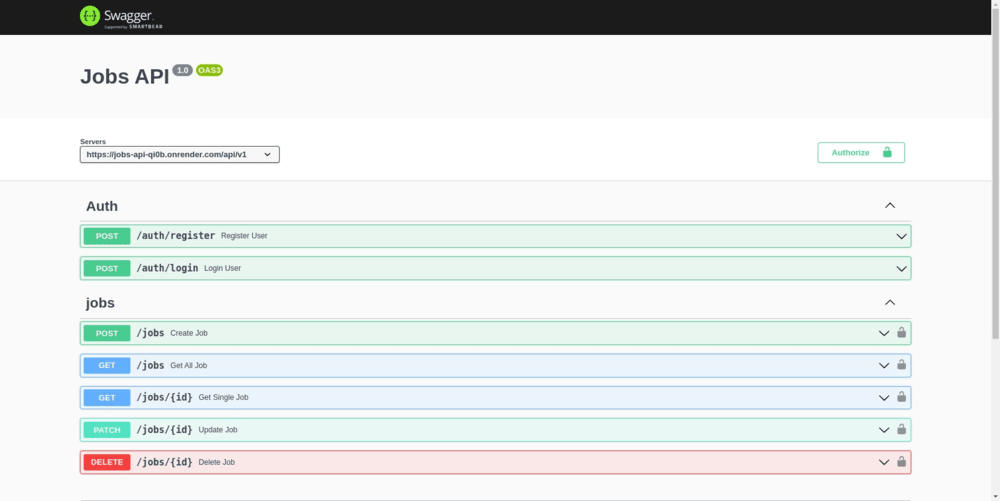

# Jobs API


## About The Project

### Job management API using NodeJS, ExpressJS and MongoDB



## API endpoints

**Main URL**: [https://jobs-api-qi0b.onrender.com/api-docs/](https://jobs-api-qi0b.onrender.com/api-docs/)

**Auth**

- Register User: [/auth/register](auth/register) [POST]
- Login User: [/auth/login](auth/login) [POST]

**Jobs**

- Get all jobs: [/jobs](/jobs?status=all&jobType=all&page=1) [GET]
- Create job: [/jobs](/jobs) [POST]
- Update job: [/jobs/:id](/jobs/:id) [PATCH]
- Delete job: [/jobs/:id](/jobs/:id) [DELETE]

#### installing Locally

1. Clone the repo

   ```sh
   git clone git@github.com:brunoanunciacaosouza/jobs-API.git
   ```

2. go to project folder

   ```sh
   cd jobify
   ```

3. install dependencies

   ```bash
   npm run install
   ```

4. Environmental Variables Set up

   - Here are the environmental variables that needs to be set in the `.env` file in the **server directory**.
   - These are the default setting that I used for development, but you can change it to what works for you.

   ```
     PORT=3000
     MONGO_URL=<Your mongodb url>
     JWT_LIFETIME=1d
     JWT_SECRET=<any secret value of your choice>
   ```

5. Run development server

   ```sh
   npm start
   ```
